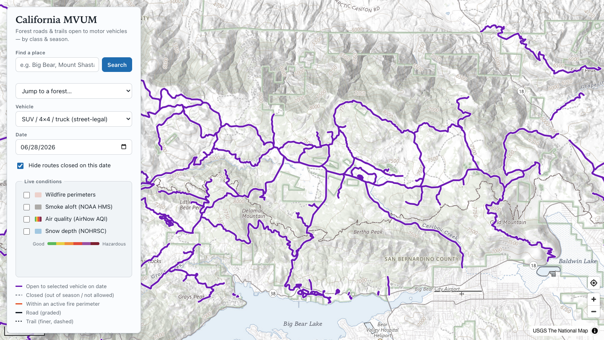

# California MVUM

A statewide map of California National Forest **Motor Vehicle Use Map** (MVUM)
routes — every Forest Service road and trail designated for motor vehicle use —
filterable by **vehicle type** and **date**, with live **fire**, **smoke**,
**air-quality**, and **snow** overlays so you can judge what's open *and*
reachable right now.

It turns the Forest Service's static, forest-by-forest MVUM PDFs into one live,
filterable map across all 17 California national forests.



> ⚠️ **Verify before you go.** MVUM shows legal *designation*, not temporary
> Forest closure orders. The fire/smoke/AQI/snow layers are situational
> awareness, not official closures. Always confirm current conditions with the
> managing forest.

## Highlights

- **All 17 CA forests, one map** — baked into a single vector-tile file, no tile
  server.
- **Street-legal vs. OHV vehicle profiles** — the question in California isn't
  "what vehicle" but "how it's registered." A plated dual-sport may use any
  highway-legal road *plus* its OHV routes; a green/red-sticker machine may use
  only OHV-designated routes. Each profile maps to the underlying MVUM class
  tokens accordingly.
- **Season-aware** — routes open/close by the MVUM `datesopen` window for the
  date you pick.
- **Roads vs. trails** — graded roads draw as bold solid lines; trails as a
  finer dashed line.
- **Find a place** — geocoded place search (CA-biased) plus a 17-forest
  quick-jump.
- **Live conditions** — fire perimeters (with the count of *your* routes inside
  one), smoke aloft, ground-level air quality, and snow depth.
- **Export what you see** — download the currently-visible open routes as a
  **GPX or KML** file to load into Gaia, onX, or a Garmin before you lose signal.
- **Tap for weather** — tap anywhere off a route for the NWS point forecast plus
  on-device sunrise/sunset and daylight-remaining (computed locally, no key).
- **Straight to the source** — every route popup links to its forest's official
  Forest Service MVUM.

## How it works

Two halves:

1. **Python build pipeline** (`pipeline/`) pulls MVUM roads + trails from the
   USFS EDW ArcGIS service, normalizes the vehicle-class/season fields into a
   compact schema, clips to California, and bakes everything into a single
   PMTiles vector-tile file.
2. **Static web app** (`web/`) — a MapLibre GL single-page app that serves those
   tiles and fetches the live overlays client-side. No server runtime; deploys
   to any static host.

### Data sources

| Layer | Source | Freshness |
|-------|--------|-----------|
| Routes + legal access | USFS MVUM (EDW MapServer) | baked at build time |
| Wildfire perimeters | NIFC / WFIGS current interagency perimeters | live, per visit |
| Smoke aloft | NOAA HMS satellite smoke detection | live, per visit |
| Air quality (ground) | EPA AirNow combined-AQI contours | live, per visit |
| Snow depth | NOAA NOHRSC (SNODAS) snow analysis WMS | live, per visit |
| Weather forecast | NWS (api.weather.gov) point forecast | live, per tap |
| Basemap | USGS Topo (desaturated) | tiles |

**Smoke vs. air quality** are intentionally separate: HMS smoke is a plume
traced from satellite (smoke *overhead*); AirNow AQI is the interpolated surface
of ground monitors (what you actually *breathe*).

## Design

Light-only "classic cartographic" theme: the USGS topo basemap is desaturated to
a gray pencil sheet so its own green forest boundaries and blue water recede,
leaving a purple route overprint (a nod to the historical USGS photorevision
overprint) as the only saturated thing on the map. Route status is encoded by
color **and** line pattern **and** width, so it survives color-blindness and sun
glare. See `PRODUCT.md` / `DESIGN.md`.

## Build the data

Requires [uv](https://github.com/astral-sh/uv) and
[tippecanoe](https://github.com/felt/tippecanoe) (`brew install tippecanoe`).

```bash
make fetch       # MVUM roads+trails for all 17 CA forests -> data/*.geojson
make normalize   # compact schema + CA clip -> data/ca-normalized.geojson
make tiles       # tippecanoe -> web/public/tiles/routes.pmtiles
# or all three:
make data
```

The fetch is polite (paginated, retried) and takes a few minutes. Re-run it to
refresh against the latest MVUM, and bump `DATA_VINTAGE` in `web/src/config.ts`.

## Run the app

```bash
make web-install   # cd web && npm install
make dev           # vite dev server
make build         # static build -> web/dist
```

The app reads `web/public/tiles/routes.pmtiles` (committed), so it runs without
rebuilding the data.

## Deploy

Live at **https://ca-mvum.typearson.dev**, hosted on **Cloudflare Pages**.

It's a pure static build, so any static host works. The repo is wired for
Cloudflare Pages **Git auto-deploy** — every push to `main` builds and ships:

| Pages build setting | Value |
|---------------------|-------|
| Root directory | `web` |
| Build command | `npm run build` |
| Build output directory | `dist` |

Manual deploy (bypassing Git), from `web/`:

```bash
npm run build
npx wrangler pages deploy dist --project-name ca-mvum --branch main
```

### Tiles: R2 + range requests

The app (HTML/CSS/JS) ships via Pages, but the route tiles live in a **Cloudflare
R2 bucket** (`ca-mvum-tiles`) served at **https://tiles.ca-mvum.typearson.dev**.
PMTiles reads them with **HTTP range requests** — only the bytes for the tiles in
view are fetched, so the map paints fast and a visitor who never leaves one area
never downloads the whole ~16 MB archive. R2 is the right host for this because it
serves real `206` range responses and CORS (Cloudflare Pages does not — it returns
the whole file with a `200`, which the PMTiles client rejects).

`web/src/config.ts` points production at R2 when `import.meta.env.PROD` is set (a
plain `vite build`), and falls back to the local committed file in dev. The tile
upload is automated separately from the app deploy:

| What | How | Trigger |
|------|-----|---------|
| App (HTML/JS/tiles fallback) | Cloudflare Pages Git build | every push to `main` |
| Route tiles → R2 | `.github/workflows/deploy-tiles.yml` (`wrangler r2 object put`) | push to `main` that changes `web/public/tiles/routes.pmtiles` |

The tile workflow needs two repo secrets: `CLOUDFLARE_API_TOKEN` (scoped to
*Workers R2 Storage: Edit*) and `CLOUDFLARE_ACCOUNT_ID`. Manual upload, from `web/`:

```bash
npx wrangler r2 object put ca-mvum-tiles/routes.pmtiles \
  --file public/tiles/routes.pmtiles --content-type application/octet-stream --remote
```

The R2 setup (bucket, custom domain, CORS) and the rationale/rollback are in
[docs/r2-range-requests-plan.md](docs/r2-range-requests-plan.md).
`web/wrangler.toml` and `web/public/_headers` hold the Pages config.

## Project layout

```
pipeline/
  forests.py        # the 17 CA forests
  fetch_mvum.py     # paginated ArcGIS REST pull (roads + trails)
  normalize.py      # compact schema, datesopen parsing, CA clip
  build_tiles.py    # tippecanoe -> routes.pmtiles
web/
  src/config.ts     # vehicle profiles + live data endpoints + data vintage
  src/legal.ts      # vehicle/date -> open/closed expressions
  src/style.ts      # route layers (road/trail), status colors, filters
  src/fire.ts       # perimeters + route intersection
  src/smoke.ts      # HMS smoke-aloft polygons
  src/aqi.ts        # AirNow ground-level AQI contours
  src/snow.ts       # NOHRSC snow-depth WMS raster
  src/search.ts     # place geocoder + forest quick-jump
  src/export.ts     # GPX/KML export of the visible open routes
  src/weather.ts    # tap-for-weather (NWS) + on-device sun times
  src/main.ts       # map, controls, popups
PRODUCT.md / DESIGN.md   # impeccable design context
```

## Disclaimers & credits

MVUM, NOHRSC, and NWS data are U.S. government works. Fire data © NIFC/WFIGS;
smoke © NOAA HMS; air quality © EPA AirNow; place search © OpenStreetMap/Nominatim
contributors. Basemap © USGS The National Map. This is a planning aid, not a
legal authority.

## License

Source code under the [MIT License](LICENSE). Third-party data is subject to its
providers' own terms (see above).
